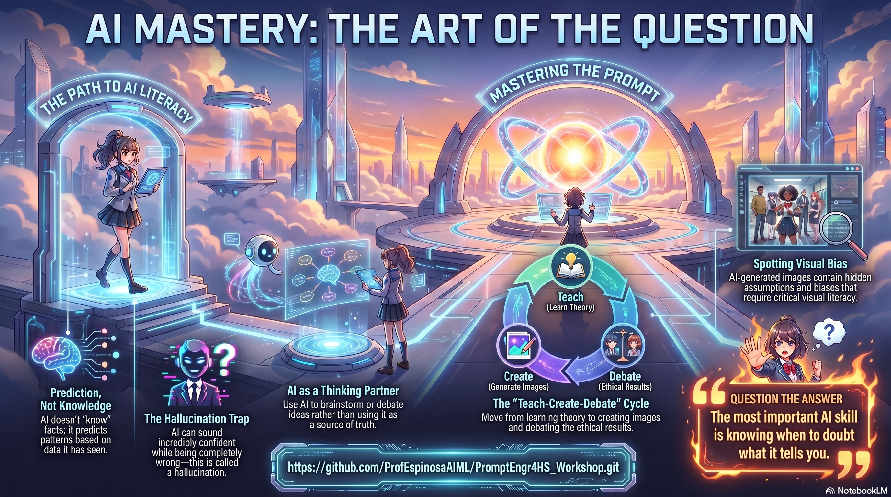

# Prompt Engineering for High School
**Learning to Question AI, Not Just Use It**

This repository contains a **50‑minute interactive workshop** designed for **Grades 10–12** students.  
The goal is to help students learn how to use AI tools (like Copilot or Gemini) **thoughtfully, creatively, and responsibly**—not just to get quick answers.

The workshop is organized into **five Jupyter Notebooks**, which students can follow in order during class or review later.

---

## 🎯 Learning Objectives

By the end of this workshop, students should be able to:

- ✅ Understand that AI does **not “know” things**, but predicts patterns based on data  
- ✅ Write better prompts by **asking clearer and more thoughtful questions**  
- ✅ See how AI can sound confident while still being wrong (called *hallucination*)  
- ✅ Use AI as a **thinking partner**, not a source of truth  
- ✅ Critically evaluate AI‑generated **text and images**  
- ✅ Decide **when AI is helpful and when it should not be trusted**

This workshop focuses on **critical thinking**, not technical skills or coding.

---

## 🗂️ How the Workshop Is Organized

The workshop follows a simple learning flow:

**Teach → Create → Debate**

Each notebook builds on the previous one.

---

## 📘 Notebook Overview

### `00_Welcome_and_Ground_Rules.ipynb`  
**Getting the Big Picture**

- Sets expectations for the workshop  
- Explains what AI is (and is not) in simple language  
- Introduces the idea that *confidence ≠ correctness*  
- Helps students reflect on how they already use AI

🧠 Focus: mindset and curiosity

---

### `01_Breaking_AI_On_Purpose.ipynb`  
**Seeing AI Fail (On Purpose)**

- Students explore future jobs that “might exist in 2035”  
- They ask AI for experts, studies, and evidence  
- The notebook is designed so AI often **hallucinates**  
- Students learn to spot answers that *sound real* but are not verifiable

🧠 Focus: skepticism and evidence

---

### `02_Prompt_Cards_and_Student_Challenges.ipynb`  
**Prompting as a Thinking Skill**

- Students use “Prompt Cards” (Zoom Out, Find Debates, Name Experts, etc.)  
- They explore a topic they care about (AI in schools, social media, climate, future jobs, etc.)  
- Emphasis on rewriting prompts and asking better follow‑ups

🧠 Focus: iteration and questioning

---

### `03_Create_Mode_Text_to_Image.ipynb`  
**AI Images, Bias, and Visual Persuasion**

- Students generate AI images using Copilot’s **Create** feature  
- They compare images created from different perspectives  
- They discuss hidden assumptions, bias, and persuasion in visuals  
- Optional extension: text‑to‑video

🧠 Focus: visual literacy and bias

---

### `04_Debate_and_Reflection.ipynb`  
**Judgment and Responsible Use**

- Small‑group discussion and whole‑class debate  
- Students decide what AI does well, what it does poorly, and what still matters for humans  
- Final reflection on how they will use AI differently moving forward

🧠 Focus: judgment and responsibility

---

## 🧑‍🏫 How to Use This Repository

- Students should open the notebooks **in order**
- No coding or programming knowledge is required
- Students will need access to an AI tool (Copilot, Gemini, or similar)
- The notebooks are designed to encourage **discussion, not just typing**

This workshop works best:
- In pairs or small groups (2–3 students)
- With open conversation and questioning
- When students feel safe being unsure or changing their minds

---

## ✅ Key Takeaway for Students

> **The most important AI skill is not getting faster answers.  
> It is knowing when to question the answer.**

---

If you are a teacher or facilitator, feel free to adapt timing, pause for discussion, or skip optional sections depending on your class needs.